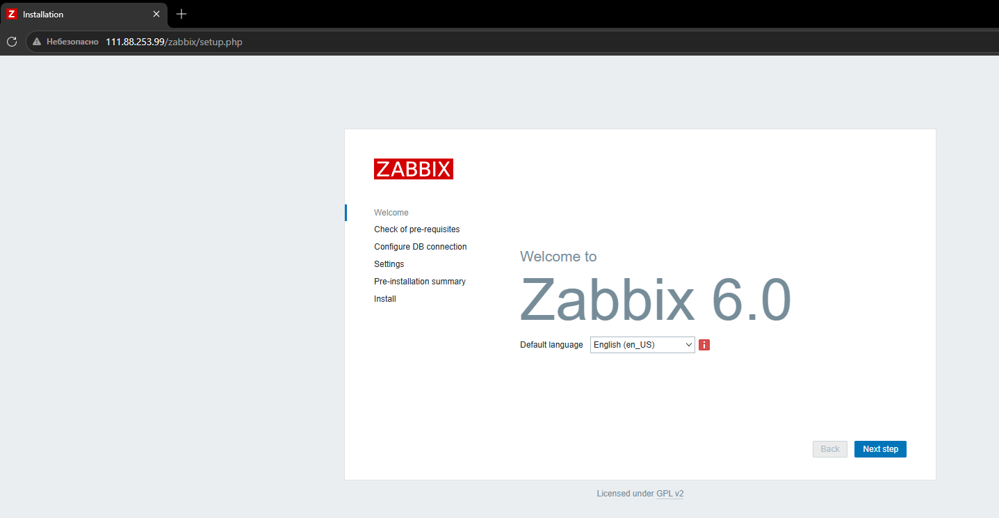
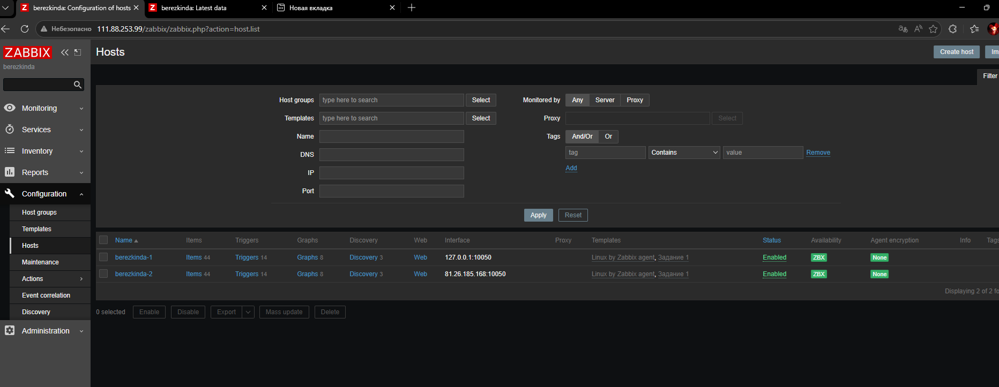
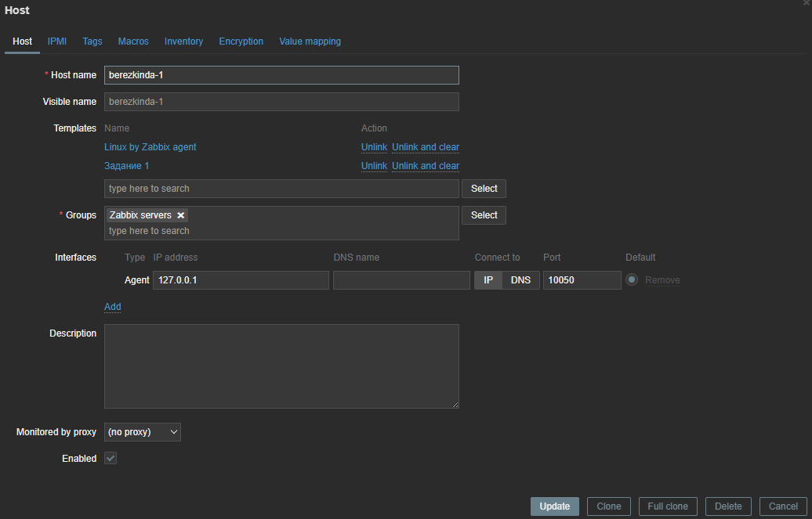
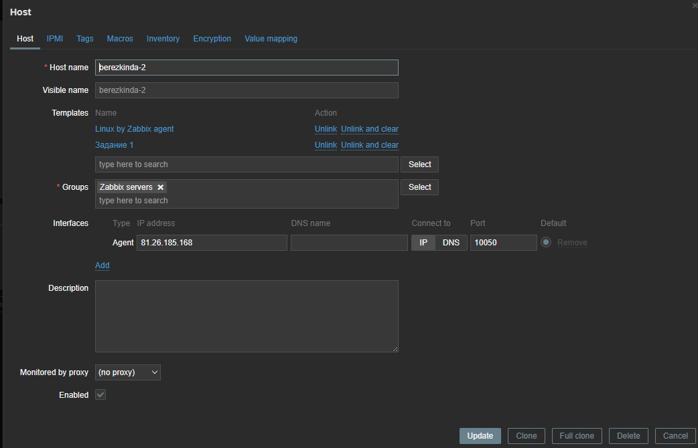
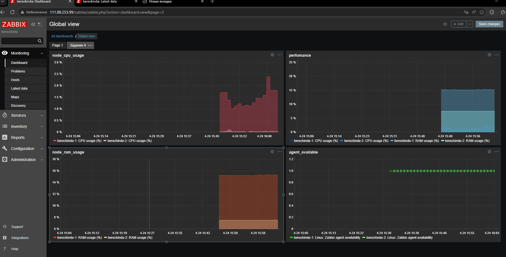

# Домашнее задание к занятию "`Система мониторинга Zabbix. Часть 2`" - `<Березкин Даниил>`

### Задание 1

`Скриншот страницы шаблона с названием «Задание 1»`

`

---

### Задание 2

`Результат данного задания идет вместе с заданием 3`

---
### Задание 3!~!

`Скриншот страницы хостов, где видны хосты, зелёный статус подключения и привязанные шаблоны "Linux by Zabbix agent" и "Задание 1":`

`

`

`

---

### Задание 4

`Скриншот дашборда с названием «Задание 4»`

`

---
