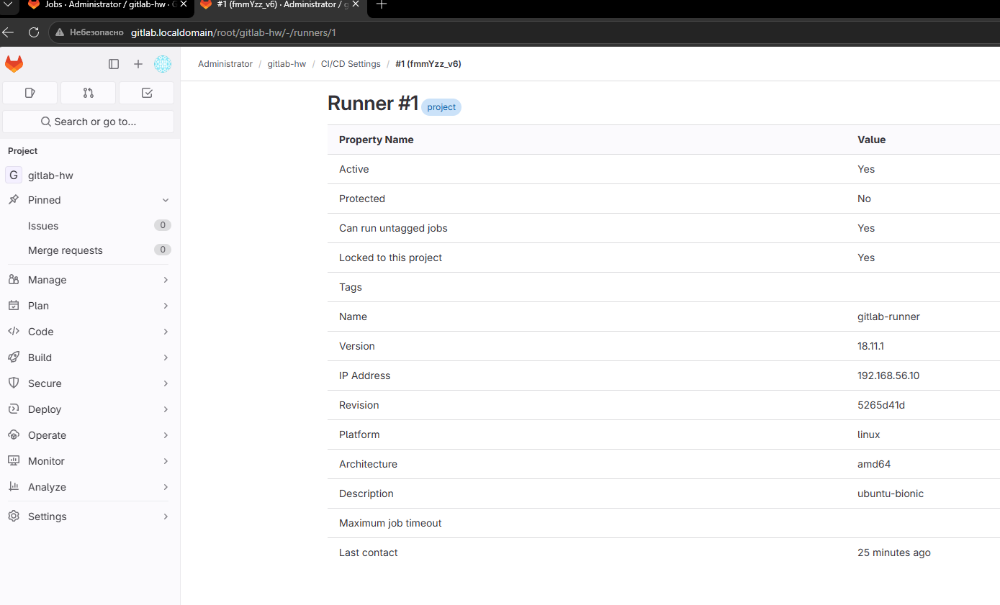
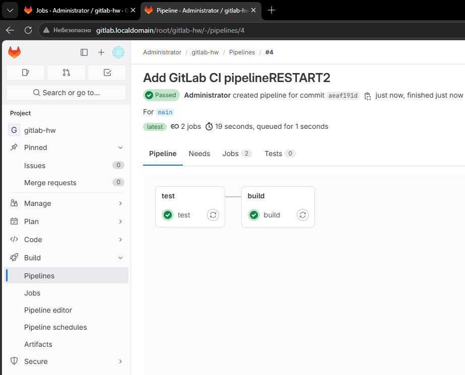
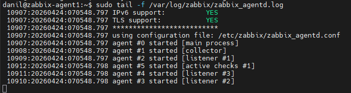
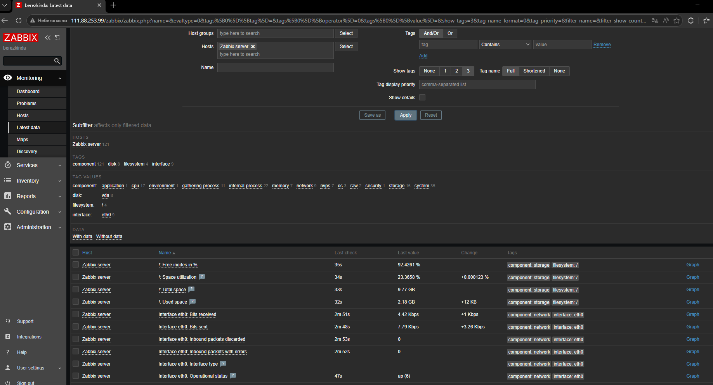
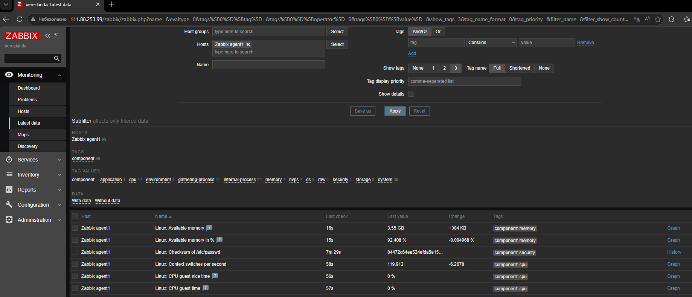

# Домашнее задание к занятию "`Система мониторинга Zabbix`" - `<Березкин Даниил>`

### Задание 1

`Скриншоты авторизации в админке`

`

`

`Текст использованных команд в GitHub`

```
wget https://repo.zabbix.com/zabbix/6.0/debian/pool/main/z/zabbix-release/zabbix-release_latest_6.0+debian11_all.deb
dpkg -i zabbix-release_latest_6.0+debian11_all.deb
sudo dpkg -i zabbix-release_latest_6.0+debian11_all.deb
sudo apt update
sudo apt install zabbix-server-pgsql zabbix-frontend-php php7.4-pgsql zabbix-apache-conf zabbix-sql-scripts
sudo apt install postgresql postgresql-contrib
sudo -u postgres createuser --pwprompt zabbix
sudo -u postgres createdb -O zabbix zabbix
zcat /usr/share/zabbix-sql-scripts/postgresql/server.sql.gz | sudo -u zabbix psql zabbix
sudo nano /etc/zabbix/zabbix_server.conf
sudo systemctl restart zabbix-server apache2
sudo systemctl enable zabbix-server apache2
```

---

### Задание 2

`Скриншот раздела Configuration > Hosts, где видно, что агенты подключены к серверу`

`

`Скриншот лога zabbix agent, где видно, что он работает с сервером`

`

`Скриншот раздела Monitoring > Latest data для обоих хостов, где видны поступающие от агентов данные`
`Для zabbix server`
`
`Для второго сервера`
`

`Текст использованных команд в GitHub`
`На zabbix server`
```
sudo apt install zabbix-agent
sudo systemctl restart zabbix-agent
sudo systemctl enable zabbix-agent
```
`Больше действий не требуется т.к. локалхост уже прописан для разрешенных серверов у zabbix агента и репо уже установлен на этом сервере`

`На втором сервере`
```
wget https://repo.zabbix.com/zabbix/6.0/debian/pool/main/z/zabbix-release/zabbix-release_latest_6.0+debian11_all.deb
sudo dpkg -i zabbix-release_latest_6.0+debian11_all.deb
sudo apt update
sudo apt install zabbix-agent
sudo nano /etc/zabbix/zabbix_agentd.conf
sudo systemctl restart zabbix-agent
sudo systemctl enable zabbix-agent
sudo tail -f /var/log/zabbix/zabbix_agentd.log
```

---
