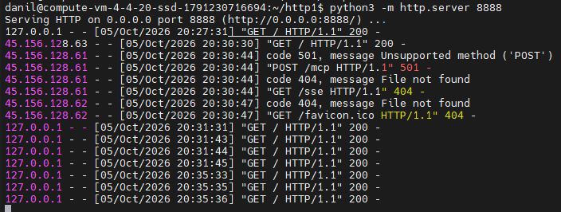
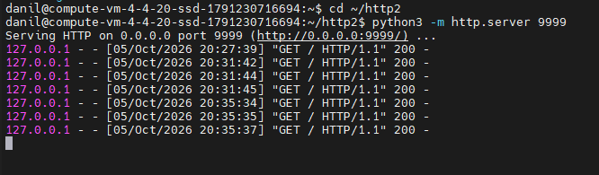
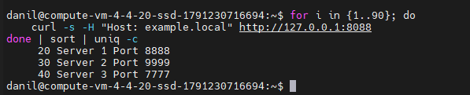
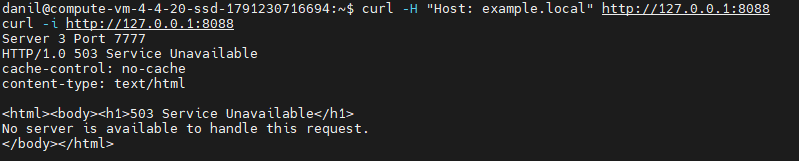

# Домашнее задание к занятию "`Кластеризация и балансировка нагрузки`" - `<Березкин Даниил>`

### Задание 1

`Файл конфигурации haproxy.cfg располагается в данном репозитории Конфигурации\Задание 1`
`Скриншоты успешной проверки конфигурации haproxy + проверка балансировки «Задание 1»`
`
`
`
---

### Задание 2
`Файл конфигурации haproxy.cfg располагается в данном репозитории Конфигурации\Задание 2`
`Скрниншот успешной отработки балансировки Weighted Round Robin`
`

`Перенаправление запросов при обращении к HAProxy с использованием домена example.local и без него`
`
---