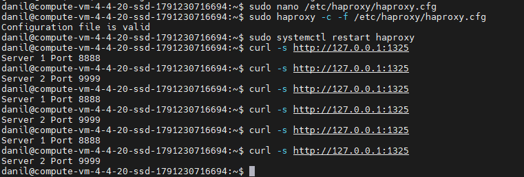

# Домашнее задание к занятию "`Кластеризация и балансировка нагрузки`" - `<Березкин Даниил>`

### Задание 1

`Скриншот страницы шаблона с названием «Задание 1»`

`

---

### Задание 2

`Результат данного задания идет вместе с заданием 3`

---